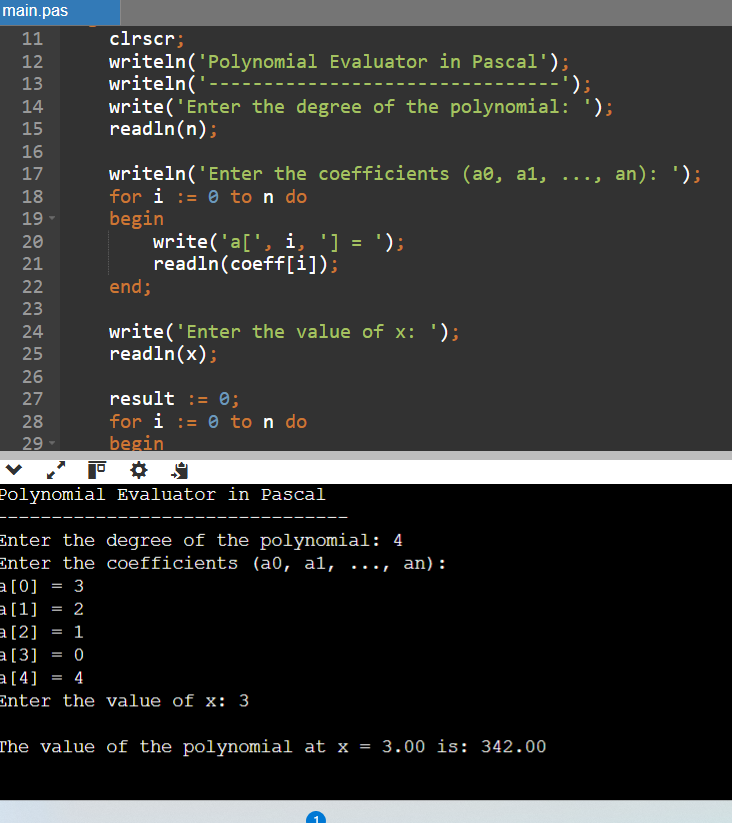

# Polynomial Evaluator (Pascal)

This is a simple Pascal program to evaluate a polynomial of the form:

P(x) = a0 + a1*x + a2*x^2 + ... + an*x^n

given its coefficients and a value of x.

---

## 🚀 Features
- Accepts polynomial degree from user
- Accepts coefficients (a0, a1, ..., an)
- Accepts value of x
- Computes and displays the result of the polynomial evaluation

---

## 📄 Example

### Input
```
Degree of polynomial: 2
Coefficients: 2, 3, 1
x = 2
```

### Output
```
The value of the polynomial at x = 2.00 is: 12.00
```

Explanation:  
P(2) = 2 + 3(2) + 1(2^2) = 12

---

## 🛠 How to Run

### Option 1: Using Online Compiler
- Go to [OnlineGDB Pascal Compiler](https://www.onlinegdb.com/online_pascal_compiler)  
- Copy the code from `poly.pas`  
- Paste it and click **Run**

### Option 2: Using Free Pascal Compiler (FPC)
1. Install [Free Pascal](https://www.freepascal.org/download.var)  
2. Save the program as `poly.pas`  
3. Open terminal/command prompt and run:
   ```bash
   fpc poly.pas
   ./poly   # Linux/Mac
   poly.exe # Windows
   ```

---

## 📂 Files
- `poly.pas` → Pascal source code
- `README.md` → Project documentation

---

## ⚡ Future Improvements
- Use Horner’s method for efficient evaluation
- Add polynomial differentiation
- Support polynomial plotting

## Screenshot

